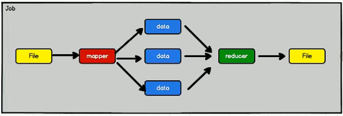
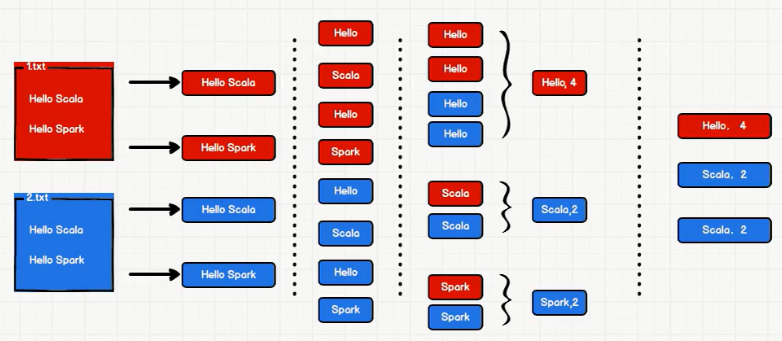

# spark 常识

## 1 hadoop与spark的区别

**Spark是Hadoop MapReduce的替代者，而不是Hadoop的替代者。**

* hadoop：一次性数据计算和**基于磁盘**

框架在处理数据的时候，会从存储设备中读取数据，进行逻辑操作，然后将处理的结果重新存储到介质中。

上述图中显示为1个job，可以看见hadoop的数据处理模型很简单，但如果要处理复杂逻辑的时候，性能较低，不适合迭代处理，要把逻辑拆分成多个job，也就是上面图中的job多复制几个首尾相连。

* spark：丰富的数据处理模型和**基于内存**来对数据集进行多次迭代。

对hadoop进行的升级，将中间的磁盘换成了内存，即把中间的计算结果放进内存中，为下一次的计算提供了更加快速的方式。

问题：spark如果部署在共享的环境中，可能会带来资源不足的问题。

## 2 核心模块

1. spark core：核心提供基础
2. spark sql：处理结构化数据操作
3. spark stream：处理流式数据操作
4. spark mLib：机器学习相关
5. spark graphX：图形挖掘计算

只学前3点。

## 3 案例->wordCount

