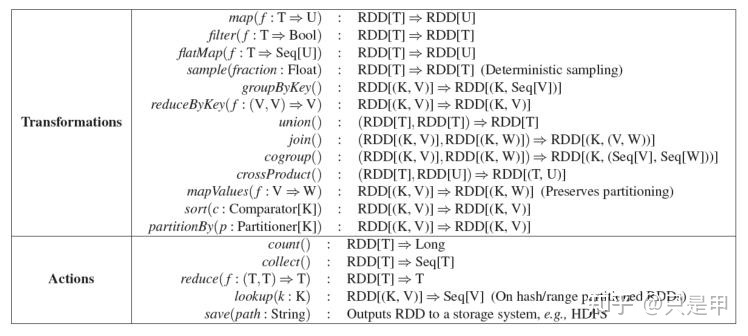

# RDD 操作

`rdd`支持2种类型的操作:

* 转换：从现有数据集创建一个新的数据集
* 操作：在数据集上运行计算后向驱动程序返回一个值

例如，

* `map`是一种转换，它通过一个函数传递每个数据集元素并返回一个表示结果的新RDD。
* `reduce`是一个操作，它使用一些函数聚合RDD的所有元素，并将最终结果返回给驱动程序(尽管也有一个并行的reduceByKey返回一个分布式数据集)。

Spark中的所有转换都是**惰性**的，因为它们不会立即计算结果。相反，他们只记住应用到一些基本数据集(例如，一个文件)的转换。只有当一个操作需要将结果返回给驱动程序时，才会计算转换。这种设计使Spark能够更高效地运行。
>例如，我们可以认识到通过map创建的数据集将用于reduce，并且只将reduce的结果返回给驱动程序，而不是更大的映射数据集。

默认情况下，每次在转换后的RDD上运行操作时都可能重新计算。但是，您也可以使用persist(或cache)方法将RDD持久化到内存中，在这种情况下，Spark将在集群中保留元素，以便在下次查询时更快地访问它。它还支持在磁盘上持久化rdd，或跨多个节点复制rdd。

## 1 基础知识

为了说明RDD的基础知识，考虑下面这个简单的程序:

```
//从外部文件定义了一个基本RDD。这个数据集不会被加载到内存中，也不会被执行，lines仅仅是一个指向文件的指针。
JavaRDD<String> lines = sc.textFile("data.txt");

//定义linelength作为映射转换的结果。同样，由于惰性，不能立即计算linelength。
JavaRDD<Integer> lineLengths = lines.map(s -> s.length());

//运行reduce，这是一个动作。此时，Spark将计算分解为任务，在不同的机器上运行，
//每台机器同时运行自己的部分map和局部reduce，只将其答案返回给驱动程序。
int totalLength = lineLengths.reduce((a, b) -> a + b);
```

如果我们**以后还想使用**`lineLengths`，我们可以添加下面这行代码在reduce之前:

```
lineLengths.persist(StorageLevel.MEMORY_ONLY());
```

这将导致linelength在第一次计算之后被保存在内存中。

## 2 将函数传递给Spark

Spark的API在很大程度上依赖于在驱动程序中传递**函数**来在集群上运行。

在Java中，函数由实现org.apache.spark.api.java.function包中的接口的类表示。有2种方法可以创建这样的函数: 

1. 在您自己的类中**实现Function接口**，无论是匿名内部类还是命名内部类，并将其实例传递给Spark。 
2. 使用**lambda表达式**来精确定义一个实现。

本指南的大部分内容都使用`lambda`语法以达到简练性，但是也可以很轻松地**以实现function这种长格式**来使用所有相同的api。例如，我们可以这样写上面的代码:

```
JavaRDD<String> lines = sc.textFile("data.txt");
JavaRDD<Integer> lineLengths = lines.map(new Function<String, Integer>() {
  public Integer call(String s) { return s.length(); }
});
int totalLength = lineLengths.reduce(new Function2<Integer, Integer, Integer>() {
  public Integer call(Integer a, Integer b) { return a + b; }
});
```

但极其不推荐下方这种内联函数写法：

```
class GetLength implements Function<String, Integer> {
  public Integer call(String s) { return s.length(); }
}
class Sum implements Function2<Integer, Integer, Integer> {
  public Integer call(Integer a, Integer b) { return a + b; }
}

JavaRDD<String> lines = sc.textFile("data.txt");
JavaRDD<Integer> lineLengths = lines.map(new GetLength());
int totalLength = lineLengths.reduce(new Sum());
```

## 3 理解闭包

Spark的难点之一是理解**跨集群**执行代码时**变量**和**方法**的**作用域**和**生命周期**。

在RDD范围之外修改变量的操作经常会引起混淆。在下面的示例中，我们将查看使用`foreach()`增加计数器的代码，但其他操作也可能出现类似的问题。

举例: 考虑下面的简单`rdd.foreach`，它的行为可能会因执行**是否**发生在**同一个**JVM中**而不同**。

>一个常见的例子是：
>* 在本地模式下运行Spark(如`--master = local[n]`)
>* 与在集群中部署Spark应用(如`Spark -submit to YARN`)

```
int counter = 0;
JavaRDD<Integer> rdd = sc.parallelize(data);

//这样写是错的
rdd.foreach(x -> counter += x);

println("Counter value: " + counter);
```

上述代码的行为是未定义的，可能无法按照预期工作。

为了执行作业，Spark将RDD操作的处理**分解为任务**，每个任务由一个**执行器**执行。

在执行之前，Spark会计算任务的**闭包**。

* 闭包：是执行器在RDD上执行计算时必须可见的变量和方法(在本例中为foreach())。这个闭包被**序列化**并发送给每个执行器。

**闭包中发送给每个执行器的变量现在是副本**，

因此，当`counter`在foreach函数中被引用时，它不再是驱动程序节点上的计数器。驱动程序节点的内存中仍然有一个计数器，但对执行器不再可见！**执行器只能看到序列化闭包的副本**。

因此，counter的最终值**仍然为零**，因为计数器上的所有操作都引用了序列化闭包中的值。

### 3.1 foreach：Local vs. cluster modes

* **在本地模式下**，

在某些情况下，foreach函数实际上将在与驱动程序相同的JVM中执行，并将引用相同的原始计数器，并可能实际更新它。

为了确保在这些场景中定义良好的行为，应该使用**累加器**。Spark中的累加器专门用于提供一种机制，当执行在集群中的工作节点之间拆分时，可以安全地更新变量。

>本指南的“累加器”一节将对此进行更详细的讨论。

>**官方说法：**
>一般来说，闭包如循环或局部定义的方法这样的构造，不应该用来改变某些全局状态。
>Spark不定义或保证从闭包外部引用的对象的突变行为。有些代码可能在**本地模式**下工作，但这只是偶然的，这样的代码在**分布式模式**下不会像预期的那样工作。如果需要一些全局聚合，则使用累加器。

### 3.2 打印RDD的元素 

另一个常见的习惯用法是尝试使用`RDD.foreach(println)`或`RDD.map(println)`打印RDD的元素。

* 在**一台机器**上，这将生成预期的输出并打印所有RDD的元素。
* 而在**集群模式**下，执行器调用的到stdout的输出是现在正在写入执行器的stdout，而不是驱动程序上的stdout，所以驱动程序上的stdout不会显示这些！

要打印驱动程序上的所有元素，可以使用collect()方法首先将RDD带到驱动程序节点:`RDD.collect().foreach(println)`。

但是，这可能会导致驱动程序耗尽内存，因为collect()将整个RDD获取到一台机器上；

如果你只需要打印RDD的一些元素，一个更安全的方法是使用take：`RDD.take(100).foreach(println)`。

## 4 使用键值对

虽然大多数Spark操作在包含任何类型对象的rdd上工作，但有一些**特殊操作**只在**键值对的rdd**上可用。最常见的是**分布式“洗牌”**操作，例如按键对元素进行**分组**或**聚合**。

在Java中，键值对使用`scala`表示，来自Scala标准库的Tuple2类。

可以简单地调用`new Tuple2(a, b)`来创建一个元组，然后使用`tuple._1()`和`tuple._2()`来访问它的`key`和`value`。

键值对的rdd由**JavaPairRDD类**表示。可以使用特殊版本的映射操作从javardd构建javapairrdd，如：

* `mapToPair`
* `flatMapToPair`

JavaPairRDD既有标准的RDD函数，也有特殊的键值函数。

例如，以下代码使用键值对上的`reduceByKey`操作来计算**每行文本在文件中出现的次数**:

```
JavaRDD<String> lines = sc.textFile("data.txt");
JavaPairRDD<String, Integer> pairs = lines.mapToPair(s -> new Tuple2(s, 1));
JavaPairRDD<String, Integer> counts = pairs.reduceByKey((a, b) -> a + b);
```

例如，我们也可以使用`counts.sortByKey()`来按字母顺序排序，最后使用`counts.collect()`将它们作为对象数组**返回到驱动程序**中。

>注意：当在键值对操作中使用自定义对象作为键时，必须确保自定义equals()方法与匹配的hashCode()方法一起使用。有关详细信息，请参阅Object.hashCode()文档中概述的契约。

## 5 常见Transformations操作及Actions操作

### 5.1 常见Transformations操作

| Transformation | 含义 | 
|-|-| 
| `map(func)` | 对每个RDD元素应用func之后，构造成新的RDD | 
| `filter(func)` | 对每个RDD元素应用func, 将func为true的元素构造成新的RDD | 
| `flatMap(func)` | 和map类似,但是flatMap可以将一个输出元素映射成0个或多个元素。(也就是说func返回的是元素序列而不是单个元素). | 
| `mapPartitions(func)` | 和map类似，但是在RDD的不同分区上独立执行。所以函数func的参数是一个Python迭代器，输出结果也应该是迭代器【即func作用为`Iterator => Iterator`】 | 
| `mapPartitionsWithIndex(func)` | 和mapPartitions类似, but also provides func with an integer value representing the index of the partition, 但是还为函数func提供了一个正式参数，用来表示分区的编号。【此时func作用为`(Int, Iterator) => Iterator` 】 | 
| `sample(withReplacement, fraction, seed)` | 抽样: fraction是抽样的比例0~1之间的浮点数; withRepacement表示是否有放回抽样, True是有放回, False是无放回；seed是随机种子。 | 
| `union(otherDataset)` | 并集操作，重复元素会保留（可以通过distinct操作去重） | 
| `intersection(otherDataset)` | 交集操作，结果不会包含重复元素 | 
| `distinct([numTasks]))` | 去重操作 | 
| `groupByKey([numTasks])` | 把Key相同的数据放到一起【`(K, V) => (K, Iterable)`】，需要注意的问题：1. 如果分组(grouping)操作是为了后续的聚集(aggregation)操作(例如sum/average)， 使用reduceByKey或者aggregateByKey更高效。2.默认情况下，并发度取决于分区数量。我们可以传入参数numTasks来调整并发任务数。 | 
| `reduceByKey(func, [numTasks])` | 首先按Key分组，然后将相同Key对应的所有Value都执行func操作得到一个值。func必须是(V, V) => V'的计算操作。numTasks作用跟上面提到的groupByKey一样。 | 
| `sortByKey([ascending], [numTasks])` | 按Key排序。通过第一个参数True/False指定是升序还是降序。 | 
| `join(otherDataset, [numTasks])` | 类似SQL中的连接(内连接)，即`(K, V)` and `(K, W) => (K, (V, W))`，返回所有连接对。外连接通过:leftOUterJoin(左出现右无匹配为空)、rightOuterJoin（右全出现左无匹配为空）、fullOuterJoin实现（左右全出现无匹配为空）。 | 
| `cogroup(otherDataset, [numTasks])` | 对两个RDD做groupBy。即`(K, V)` and `(K, W) => (K, Iterable, Iterable(W))`。别名groupWith。 | 
| `pipe(command, [envVars])` | 将驱动程序中的RDD交给shell处理（外部进程），例如Perl或bash脚本。RDD元素作为标准输入传给脚本，脚本处理之后的标准输出会作为新的RDD返回给驱动程序。 | 
| `coalesce(numPartitions)` | 将RDD的分区数减小到numPartitions。当数据集通过过滤减小规模时，使用这个操作可以提升性能。 | 
| `repartition(numPartitions)` | 将数据重新随机分区为numPartitions个。这会导致整个RDD的数据在集群网络中洗牌。 | 
| `repartitionAndSortWithinPartitions(partitioner)` | 使用partitioner函数充分去，并在分区内排序。这比先repartition然后在分区内sort高效，原因是这样迫使排序操作被移到了shuffle阶段。 |

### 5.2 常见Actions操作

| Action | 含义 | 
|-|-| 
| `reduce(func)` | 使用func函数聚集RDD中的元素（func接收两个参数返回一个值）。这个函数应该满足结合律和交换律以便能够正确并行计算。 | 
| `collect()` | 将RDD转为数组返回给驱动程序。这个在执行filter等操作之后返回足够小的数据集是比较有用。 | 
| `count()` | 返回RDD中的元素数量。 | 
| `first()` | 返回RDD中的第一个元素。（同take(1)) | 
| `take(n)` | 返回由RDD的前N个元素组成的数组。 | 
| `takeSample(withReplacement, num, [seed])` | 返回num个元素的数组，这些元素抽样自RDD，withReplacement表示是否有放回，seed是随机数生成器的种子）。 | 
| `takeOrdered(n, [ordering])` | 返回RDD的前Ｎ个元素，使用自然顺序或者通过ordering函数对将个元素转换为新的Key. | 
| `saveAsTextFile(path)` | 将RDD元素写入文本文件。Spark自动调用元素的toString方法做字符串转换。 | 
| `saveAsSequenceFile(path)`(Java and Scala) | 将RDD保存为Hadoop SequenceFile.这个过程机制如下：1. Pyrolite用来将序列化的Python RDD转为Java对象RDD;2. Java RDD中的Key/Value被转为Writable然后写到文件。 | 
| `countByKey()` | 统计每个Key出现的次数，只对(K, V)类型的RDD有效，返回(K, int)词典。 | 
| `foreach(func)` | 在所有RDD元素上执行函数func。 |

### 5.3 总结



上图是关于Transformations和Actions的一个介绍图解，可以发现，

* Transformations操作过后的**RDD依旧是RDD**，
* Actions过后的**RDD都是非RDD**。