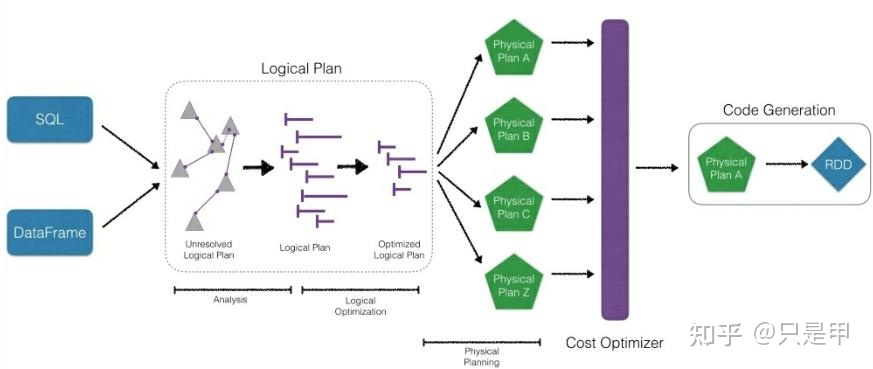
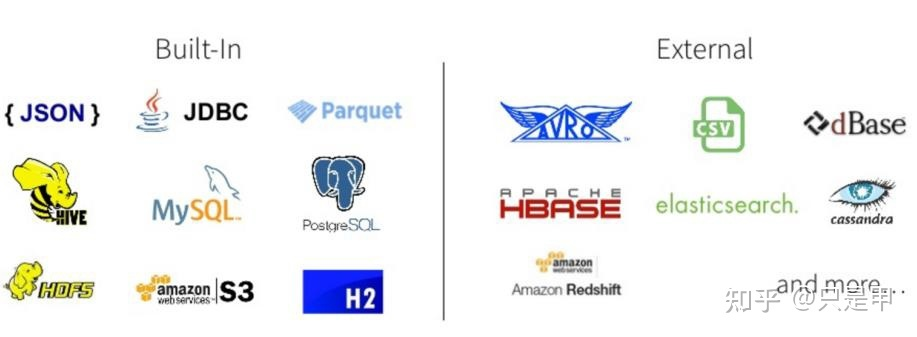
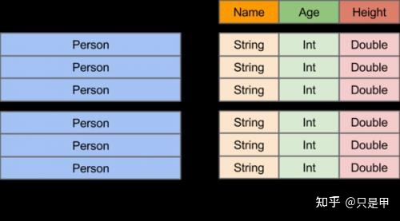

# Spark SQL 

## 1 概述

### 1.1 来源

Hive是目前大数据领域，事实上的数据仓库**标准**。

Hive与RDBMS的SQL模型比较类似，容易掌握。 Hive的主要缺陷在于它的底层是基于MapReduce的，执行比较慢。

在Spark 0.x版的时候推出了Shark，Shark与Hive是紧密关联的，Shark底层很多东西还是依赖于Hive，修改了内存管理、物理计划、执行三个模块，底层使用Spark的基于内存的计算模型，性能上比Hive提升了很多倍。

在Spark 1.x的时候Shark被淘汰。在2014 年7月1日的Spark Summit 上， Databricks宣布终止对Shark的开发，将重点放到 Spark SQL 上。

Shark终止以后，产生了两个分支:

1. Hive on Spark hive社区的，源码在hive中
2. Spark SQL(Spark on Hive) Spark社区，源码在Spark中，支持多种数据源，多种优化技术，扩展性好很多;

Spark SQL的源码在Spark中，而且新增了许多的优化代码，

* 如果追求**速度**，例如数据分析的时候，可以使用`Hive on Spark`，
* 如果追求**性能**，例如生产的定时报表的时候，应该使用`Spark SQL`。

### 1.2 Spark SQL 特点

对比`Spark RDD`、`Dataframe`、`Spark SQL`代码实现wordcount:

* `Spark RDD`：
    ```
    sc.textFile("file:///home/hadoop/derby.log).flatMap(lambda x:x.split("")).map(lambda x:(x,1)).reduceByKey(lambda a,b : a+b ).collect()
    ```

* `Dataframe`：
    ```
    df .groupBy('word' ).count( ).show()
    ```

* `Spark SQL`：
    ```
    ssc.sq|('select word,count(*) as cnt from s group by word')
    ```

可以看到，Spark SQL代码看起来与关系型数据库是一致的，并且发现Spark SQL的特点: 

* 集成：通过Spark SQL或DataFrame API运行Spark 程序,操作更加简单、快速.
  

  从上图可以看到，Spark SQL和DataFrame底层其实就是调用RDD
* 统一的数据访问：DataFrame 和SQL提供了访问各种数据源的通用方式，包括Hive、Avro、Parquet、ORC、JSON和JDBC。您甚至可以跨这些数据源连接数据。
  
* Hive集成：在现有的数据仓库上运行SQL或HiveQL查询。
* 标准的连接：服务器模式为业务智能工具提供行业标准的JDBC和ODBC连接。

### 1.3 Spark SQL的运行速度

1). Python操作RDD比Java/Scala慢一倍以上 
2). 无论是那种语言操作DataFrame，性能几乎一致

那么为什么Python用RDD这么慢? 为什么用Python写的RDD比Scala慢一倍以上？

两种不同的语言的执行引擎，上下文切换、数据传输。

Spark SQL其实底层调用的也是RDD执行，其实中间的执行计划进行了优化，而且是在Spark的优化引擎里面,所以无论是那种语言操作DataFrame，性能几乎一致。

## 2 Spark SQL数据抽象

Spark SQL提供了两个新的抽象，分别是 `Dataset`和`DataFrame`；

* Dataset是数据的分布式集合。

Dataset是Spark 1.6中添加的一个新接口，它提供了RDDs的优点(强类型、使用强大lambda函数的能力)以及Spark SQL优化的执行引擎的优点。可以从JVM对象构造数据集，然后使用函数转换(map、flatMap、filter等)操作数据集。

数据集API可以在Scala和Java中使用。Python不支持Dataset API。

但是由于Python的动态特性，Dataset API的许多优点已经可以使用了(例如，您可以通过名称natural row. columnname访问行字段)。R的情况也是类似的。

* DataFrame 是组织成**命名列**的Dataset。

它在概念上相当于**关系数据库中的表**或R/Python中的数据框架，但在底层有更丰富的优化。

数据框架可以从各种各样的数据源构建，例如:结构化数据文件、Hive中的表、外部数据库或现有的rdd。

* DataFrame API可以在Scala、Java、Python和r中使用。在Scala和Java中，DataFrame是由行数据集表示的。
* 在Scala API中，DataFrame只是Dataset[Row]的类型别名。
* 在Java API中，用户需要使用Dataset来表示DataFrame。

### 2.1 DataFrame

DataFrame的前身是SchemaRDD。Spark1.3更名为DataFrame。不继承RDD，自己实现RDD的大部分功能。

与RDD类似，DataFrame也是一个分布式数据集。

1. DataFrame可以看做分布式Row对象的集合，提供了由列组成的详细模式信息，使其可以得到优化，DataFrame不仅有比RDD更多的算子，还可以进行执行计划的优化
2. DataFrame更像传统数据库的二维表格，除了数据以外，还记录数据的结构信息，即schema
3. DataFrame也支持嵌套数据类型（struct、array和Map）
4. DataFrame API提供的是一套高层的关系操作，比函数式RDD API更加优化，门槛低
5. DataFrame的劣势在于在编译期缺少类型安全检查，导致运行时出错。



### 2.2 Dataset

Dataset时在Spark1.6中添加的新接口；与RDD相比，可以保存更多的描述信息，概念上等同于关系型数据库中的二维表。与DataFrame相比，保存了类型信息，是强类型，提供了编译时检查。

调用Dataset的方法会生成**逻辑计划**，然后Spark的优化器进行优化，最终生成**物理计划**，然后提交到集群中运行。

Dataset包含了DataFrame的功能，在Spark2.0中两者得到了统一：

`DataFrame`表示为`Dataset[Row]`，**即Dataset的子集**。

## 3 Spark SQL 操作数据库

### 3.1 Spark SQL操作Hive数据库

Spark中所有功能的入口点都是SparkSession类。

要创建一个基本的`SparkSession`，只需使用`SparkSession.builder()`:

```
import org.apache.spark.sql.SparkSession;

SparkSession spark = SparkSession
  .builder()
  .appName("Java Spark SQL basic example")
  .config("spark.some.config.option", "some-value")
  .getOrCreate();
```

>在Spark repo的`examples/src/main/java/org/apache/spark/examples/sql/JavaSparkSQLExample.java`中可以找到完整的示例代码。

Spark 2.0中的SparkSession提供了对Hive特性的内置支持，包括使用HiveQL编写查询，访问Hive udf，以及从Hive表中读取数据的能力。要使用这些特性，您不需要有一个现有的Hive设置。

#### 3.1.2 创建DataFrames

通过SparkSession，应用程序可以从现有的RDD、Hive表或Spark数据源中**创建DataFrames**。

下面是一个基于text文件内容的DataFrame示例: 代码：

```
import org.apache.spark.sql.SparkSession;
import org.apache.spark.sql.Dataset;
import org.apache.spark.sql.Row;


public class SparkSQLTest1 {
    public static void main(String[] args){
        SparkSession spark = SparkSession
                .builder()
                .appName("SparkSQLTest1")
                .config("spark.some.config.option", "some-value")
                .getOrCreate();

        Dataset<Row> df = spark.read().text("file:///home/pyspark/idcard.txt");
        df.show();

        spark.stop();
    }
}
```

运行：

```
spark-submit \
   --class org.example.SparkSQLTest1 \
   --master local[2] \
   /home/javaspark/SparkStudy-1.0-SNAPSHOT.jar
```

运行结果：

```
+------------------+
|             value|
+------------------+
|440528*******63016|
|350525*******60813|
|120102*******10789|
|452123*******30416|
|440301*******22322|
|441421*******54614|
|440301*******55416|
|232721*******40630|
|362204*******88412|
|430281*******91015|
|420117*******88355|
+------------------+
```

#### 3.1.3 以编程方式运行SQL查询

代码:

```
import org.apache.spark.sql.SparkSession;
import org.apache.spark.sql.Dataset;
import org.apache.spark.sql.Row;

public class SparkSQLTest2 {
    public static void main(String[] args){
        SparkSession spark = SparkSession
                .builder()
                .appName("SparkSQLTest2")
                .config("spark.some.config.option", "some-value")
                .getOrCreate();

        Dataset<Row> sqlDF = spark.sql("SELECT * FROM test.ods_fact_sale limit 100");
        sqlDF.show();

       spark.stop();
    }

}
```

运行结果：

```
+---+--------------------+---------+---------+
| id|           sale_date|prod_name|sale_nums|
+---+--------------------+---------+---------+
|  1|2011-08-16 00:00:...|    PROD4|       28|
|  2|2011-11-06 00:00:...|    PROD6|       19|
|  3|2011-04-25 00:00:...|    PROD8|       29|
|  4|2011-09-12 00:00:...|    PROD2|       88|
|  5|2011-05-15 00:00:...|    PROD5|       76|
|  6|2011-02-23 00:00:...|    PROD6|       64|
|  7|2012-09-26 00:00:...|    PROD2|       38|
|  8|2012-02-14 00:00:...|    PROD6|       45|
|  9|2010-04-22 00:00:...|    PROD8|       57|
| 10|2010-10-31 00:00:...|    PROD5|       65|
| 11|2010-10-24 00:00:...|    PROD2|       33|
| 12|2011-02-11 00:00:...|    PROD9|       27|
| 13|2012-07-10 00:00:...|    PROD8|       48|
| 14|2011-02-23 00:00:...|    PROD6|       46|
| 15|2010-08-10 00:00:...|    PROD4|       50|
| 16|2011-05-02 00:00:...|    PROD6|       22|
| 17|2012-07-20 00:00:...|    PROD2|       56|
| 18|2012-07-12 00:00:...|    PROD9|       57|
| 19|2011-11-18 00:00:...|    PROD6|       58|
| 20|2010-04-22 00:00:...|    PROD4|        7|
+---+--------------------+---------+---------+
only showing top 20 rows
```

### 3.2 Spark SQL操作MySQL数据库

Spark SQL不仅可以操作Hive数据库，也可以操作远程的MySQL数据库：

```
import org.apache.spark.sql.SparkSession;
import org.apache.spark.sql.Dataset;
import org.apache.spark.sql.Row;

public class SparkSQLTest3 {
    public static void main(String[] args){
        SparkSession spark = SparkSession
                .builder()
                .appName("SparkSQLTest3")
                .config("spark.some.config.option", "some-value")
                .getOrCreate();

        Dataset<Row> jdbcDF = spark.read()
                .format("jdbc")
                .option("url", "jdbc:mysql://10.31.1.123:3306/test")
                .option("dbtable", "(SELECT * FROM EMP) tmp")
                .option("user", "root")
                .option("password", "abc123")
                .load();

        jdbcDF.printSchema();
        jdbcDF.show();

        spark.stop();
    }
}
```

运行结果：

```
root
 |-- empno: integer (nullable = true)
 |-- ename: string (nullable = true)
 |-- job: string (nullable = true)
 |-- mgr: integer (nullable = true)
 |-- hiredate: date (nullable = true)
 |-- sal: decimal(7,2) (nullable = true)
 |-- comm: decimal(7,2) (nullable = true)
 |-- deptno: integer (nullable = true)

+-----+------+---------+----+----------+-------+-------+------+
|empno| ename|      job| mgr|  hiredate|    sal|   comm|deptno|
+-----+------+---------+----+----------+-------+-------+------+
| 7369| SMITH|    CLERK|7902|1980-12-17| 800.00|   null|    20|
| 7499| ALLEN| SALESMAN|7698|1981-02-20|1600.00| 300.00|    30|
| 7521|  WARD| SALESMAN|7698|1981-02-22|1250.00| 500.00|    30|
| 7566| JONES|  MANAGER|7839|1981-04-02|2975.00|   null|    20|
| 7654|MARTIN| SALESMAN|7698|1981-09-28|1250.00|1400.00|    30|
| 7698| BLAKE|  MANAGER|7839|1981-05-01|2850.00|   null|    30|
| 7782| CLARK|  MANAGER|7839|1981-06-09|2450.00|   null|    10|
| 7788| SCOTT|  ANALYST|7566|1987-06-13|3000.00|   null|    20|
| 7839|  KING|PRESIDENT|null|1981-11-17|5000.00|   null|    10|
| 7844|TURNER| SALESMAN|7698|1981-09-08|1500.00|   0.00|    30|
| 7876| ADAMS|    CLERK|7788|1987-06-13|1100.00|   null|    20|
| 7900| JAMES|    CLERK|7698|1981-12-03| 950.00|   null|    30|
| 7902|  FORD|  ANALYST|7566|1981-12-03|3000.00|   null|    20|
| 7934|MILLER|    CLERK|7782|1982-01-23|1300.00|   null|    10|
+-----+------+---------+----+----------+-------+-------+------+
```