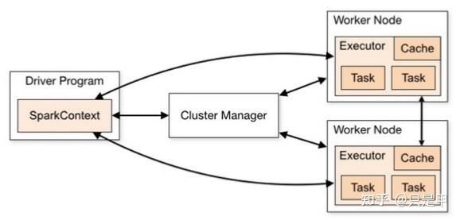

# Spark 核心组件

* `SparkContext`将资源需求提交给`Cluster Manager`， `Cluster Manager`根据需求分配资源；
* `SparkContext`将`Task`提交给`Executor`运行(`Executor=Cache + Task`)，`Executor`返回结果给`SparkContext`。

## 1 Cluster Manager (Master,ResourceManager)

`Spark`的集群管理器，主要负责对整个集群资源的分配与管理。

Cluster Manager：

* 在 Yarn 部署模式下为 ResourceManager 
* 在 Mesos 部署模式下为 Mesos Master 
* 在 Standalone 部署模式下为 Master.

一般在Yarn部署的情况多一些。

## 2 Worker (worker,NodeManager)

Spark 的工作节点。 

在 Yarn 部署模式下实际由 NodeManager 替代. 主要负责以下工作:

1. 将自己的内存, CPU 等资源通过注册机制告知 Cluster Manager 
2. 创建 Executor 
3. 将资源和任务进一步分配给 Executor
4. 同步资源信息, Executor 状态信息给 ClusterManager 等

## 3 Driver

Spark 驱动器节点，用于执行 Spark 任务中的 main 方法，负责实际代码的执行工作。

Driver 在 Spark 作业执行时主要负责: 

1. 将用户程序转化为作业（Job） 
2. 在 Executor 之间调度任务（Task） 
3. 跟踪 Executor 的执行情况 
4. 通过 UI 展示查询运行情况

## 4 Executor

Spark Executor 节点是负责在 Spark 作业中运行具体任务，任务彼此之间相互独立。 

Spark 应用启动时，Executor 节点被同时启动，并且始终伴随着整个 Spark 应用的生命周期而存在。 如果有 Executor 节点发生了故障或崩溃，Spark 应用也可以继续执行，会将出错节点上的任务调度到其他 Executor 节点上继续运行。 

Executor 有2个核心功能：

1. 负责运行组成 Spark 应用的任务，并将结果返回给驱动器（Driver） 
2. 它们通过自身的块管理器`Block Manager`为用户程序中要求缓存的 RDD 提供内存式存储。RDD 是直接缓存在 Executor 进程内的，因此任务可以在运行时充分利用缓存数据加速运算。

## 5 Application

用户使用 Spark 提供的 API 编写的应用程序

1. Application 通过 Spark API 将进行 RDD 的转换和 DAG 的构建, 并通过 Driver 将 Application 注册到 Cluster Manager. 
2. Cluster Manager 将会根据 Application 的资源需求, 通过一级分配将 Executor, 内存, CPU 等资源分配给Application. 
3. Driver 通过二级分配将 Executor 等资源分配给每一个任务, Application 最后通过 Driver 告诉 Executor 运行任务