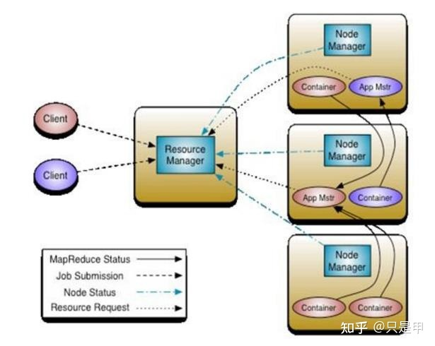
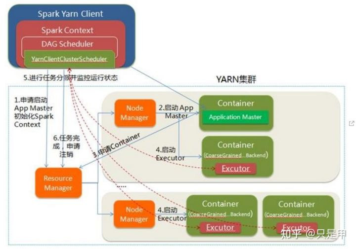
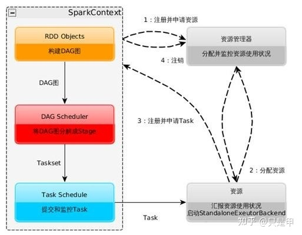

# Spark on Yarn

## 1 Yarn的基本架构

Yarn的3个组件: 

* ResourceManager、
* NodeManager、
* Application Manager



## 2 Spark on Yarn

通过spark-submit命令可以运行spark的程序，如下所示:

```
spark-submit --master MASTER_URL --deploy-mode DEPLOY_MODE
```

其中`MASTER_URL`有4种模式：

* `Local: local/local[K]、local[*]`
* `Standalone:spark://HOSR:PORT`
* `Mesos:mesos://HOST:PORT`
* `YARN: yarn-client、yarn-cluster`（根据本地hadoop配置）

调度pyspark程序实例:

```
-- spark 2.4.0版本
spark-submit --master local xxxx.py
spark-submit --master yarn --deploy-mode cluster xxxx.py
spark-submit --master yarn --deploy-mode client xxxx.py
```

### 2.1 YARN-Cluster模式

资源申请、分配在Application Master完成，

任务执行计划、调度也在Application Master完成。

### 2.2 YARN-Client模式

资源申请、分配在Application Master完成，

任务执行计划、调度在Client端完成。



## 3 Spark Job

SparkContext：

1. 构建DAG图 
2. 将DAG图分解成Stage 
3. 把Taskset发送给Task Scheduler

