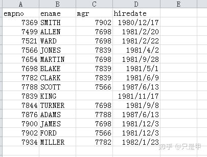

# spark SQL编程实战

## 1 Spark DataFrame概述

在Spark语义中，DtatFrame是一个分布式的行集合，可以想象为一个关系型数据库的表，或一个带有列头的Excel表格。它和RDD一样，有这样一些特点:

* Immuatable: 一旦RDD、DataFrame被创建，就不能更改，只能通过tranformation生成新的RDD、DataFrame 
* Lazy Evaluations: 只有action才会出发Transformation的执行。 
* Distributed: DataFrame和RDD一样都是分布式的。

### 1.1 创建DataFrame

支持的数据源: 

1. Parquet Files 
2. ORC Files 
3. JSON Files 
4. Hive Tables 
5. JDBC 
6. Avro Files

创建DataFrame的语法:

```
Dataset<Row> df = spark.read().json("examples/src/main/resources/people.json");
```

>Spark SQL的起点: SparkSession 代码:
>```
>    import org.apache.spark.sql.SparkSession;
>
>    SparkSession spark = SparkSession
>    .builder()
>    .appName("Java Spark SQL basic example")
>    .config("spark.some.config.option", "some-value")
>    .getOrCreate();
>```
>使用SparkSession，应用程序可以从现有的RDD、Hive表或Spark数据源中创建DataFrames。

#### 1.1.1 通过json文件创建DataFrame

Json测试文件:

```
{"name": "Michael",  "age": 12}
{"name": "Andy",  "age": 13}
{"name": "Justin",  "age": 8}
```

代码:

```
Dataset<Row> df = spark.read().json("file:///home/pyspark/test.json");
```

结果：

```
+-----+-------+
|age  | name  |
+-----+-------+
| 12  |Michael|
| 13  | Andy  |
| 8   | Justin|
+-----+-------+
```

#### 1.1.2 通过CSV文件创建DataFrame

csv测试文件:



代码：

```
Dataset<Row> df = spark.read().format("csv").option("header", "true").load("file:///home/pyspark/emp.csv");
```

结果：

```
+-----+------+----+----------+
|empno| ename| mgr|  hiredate|
+-----+------+----+----------+
| 7369| SMITH|7902|1980-12-17|
| 7499| ALLEN|7698|1981-02-20|
| 7521|  WARD|7698|1981-02-22|
| 7566| JONES|7839|1981-04-02|
| 7654|MARTIN|7698|1981-09-28|
| 7698| BLAKE|7839|1981-05-01|
| 7782| CLARK|7839|1981-06-09|
| 7788| SCOTT|7566|1987-06-13|
| 7839|  KING|null|1981-11-17|
| 7844|TURNER|7698|1981-09-08|
| 7876| ADAMS|7788|1987-06-13|
| 7900| JAMES|7698|1981-12-03|
| 7902|  FORD|7566|1981-12-03|
| 7934|MILLER|7782|1982-01-23|
+-----+------+----+----------+
```

#### 1.1.3 通过hive table创建DataFrame

代码：

```
Dataset<Row> sqlDF = spark.sql("SELECT * FROM test.ods_fact_sale limit 100");
```

#### 1.1.4 通过jdbc数据源创建DataFrame

代码：

```
Dataset<Row> jdbcDF = spark.read()
                .format("jdbc")
                .option("url", "jdbc:mysql://10.31.1.123:3306/test")
                .option("dbtable", "(SELECT * FROM EMP) tmp")
                .option("user", "root")
                .option("password", "abc123")
                .load();

jdbcDF.printSchema();
jdbcDF.show();
```

## 2 Spark SQL实战

[Java-Spark系列6-Spark SQL编程实战](https://zhuanlan.zhihu.com/p/446698408)